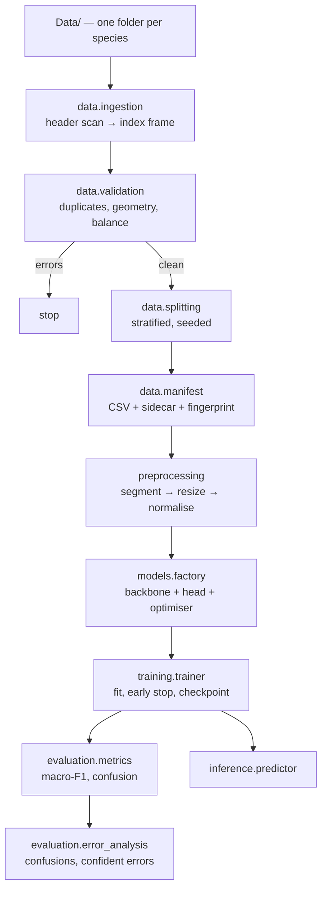

# Architecture

## The shape of the problem

Five medicinal species, a few hundred field photographs, and a hard
requirement that the reported accuracy be real. At this scale the model is
not the risk — a pretrained backbone will fit almost anything. The risks are
that duplicate images straddle the train/test boundary, that the classifier
learns the background instead of the leaf, and that a single accuracy number
hides a species the model never predicts.

The pipeline is arranged around those three risks.

## Flow

## Module responsibilities

| Module | Owns | Deliberately does not |
| --- | --- | --- |
| `config.settings` | Typed config from YAML + env + kwargs | Know anything about torch |
| `data.ingestion` | Directory scan, index frame, `LeafDataset` | Judge whether the data is good |
| `data.validation` | Duplicates, geometry, balance, decodability | Modify or drop rows |
| `data.splitting` | Stratified, seeded splits; leakage checks | Persist anything |
| `data.manifest` | CSV + sidecar IO, label mapping, fingerprint | Decide the split |
| `preprocessing.image` | Deterministic geometry and colour ops | Randomness |
| `preprocessing.segmentation` | Leaf/background separation | Learned models |
| `preprocessing.augmentation` | Train/eval transform pipelines | Image IO |
| `models.model` | `LeafClassifier`: backbone + head | Config parsing |
| `models.factory` | Build model/optimiser/scheduler/loss, checkpoint IO | The loop itself |
| `training.trainer` | Epochs, AMP, early stopping, best-checkpoint | Config branching |
| `training.train` | CLI wiring | Business logic |
| `evaluation.metrics` | Scalar and per-class metrics, confusion plot | Reading data |
| `evaluation.error_analysis` | What went wrong and how confidently | Computing headline metrics |
| `inference.predictor` | Load a checkpoint, classify images | Reading `configs/` |

## Key decisions

### The manifest is the contract

Every stage after `prepare` reads `artifacts/manifest.csv`, never the image
tree. The sidecar records the label mapping and a fingerprint over
`(path, class, split)`; checkpoints store that fingerprint, so `evaluate`
warns when a model is being scored against a split it may have trained on.
Without this, "I re-ran prepare and the numbers changed" is undiagnosable.

### Preprocessing travels with the checkpoint

`CheckpointMeta` stores image size, resize strategy, normalisation constants
and whether segmentation was on. `LeafPredictor` rebuilds its transform from
that metadata rather than from `configs/`, so editing a YAML file cannot
silently change how a deployed model sees an image. Train/serve skew of this
kind is quiet and expensive.

### Letterbox, not squash

Leaf shape is discriminative — a Neem leaflet is long and narrow, an Amla
leaf small and round. Squashing every image into a square destroys exactly
the cue the model should use, so the default resize pads instead.

### Classical segmentation, not learned

Background removal uses Excess Green (`2G − R − B` over chromatic-normalised
channels), Otsu thresholding, morphological cleanup and the largest connected
component. It needs no training data and no extra model at inference. When
the resulting mask is implausible — under 2% or over 98% coverage, which is
what a close-up of nothing but leaf produces — the original image is returned
unchanged. A learned segmenter would be more accurate and far more machinery
than this dataset justifies.

### Macro-F1 is the headline metric

With uneven class counts, accuracy is dominated by the largest species and a
model that ignores the smallest one still scores well. Early stopping
monitors `val_macro_f1` by default for the same reason.

### Frozen backbones stay in eval mode

`LeafClassifier.train()` keeps a frozen backbone in eval mode so its
BatchNorm running statistics do not drift while only the head is learning —
otherwise "frozen" is not actually frozen.

## Data contracts

**Index frame** (`data.ingestion.build_index`):

| Column | Type | Notes |
| --- | --- | --- |
| `file_path` | str | Absolute |
| `class_name` | str | Source directory name |
| `width`, `height` | int | From the header, pixels never decoded |
| `aspect_ratio` | float | `width / height` |
| `mode` | str | PIL mode before RGB conversion |
| `size_bytes` | int | On-disk size |

**Manifest** adds `split` (`train`/`val`/`test`) and `label_idx` (the
alphabetical class index).

**Prediction frame** (`evaluation.error_analysis.collect_predictions`):
`file_path`, `true_idx`, `predicted_idx`, `confidence`, `true_class_prob`,
`true_label`, `predicted_label`, `correct`.

## Configuration layering

First match wins:

1. keyword arguments to `load_settings(...)`
2. environment variables — `MLC_TRAINING__EPOCHS=40`
3. `.env` at the repository root
4. `configs/<MLC_ENV>.yaml`
5. defaults in `config/settings.py`

Relative paths in config resolve against the repository root, so the same
YAML works regardless of the working directory.

## Extension points

- **A different backbone** — set `model.backbone` to any `timm` model name.
  Nothing else changes; the head is sized from `backbone.num_features`.
- **Cross-validation** — `stratified_split` returns a frame rather than
  writing one, so a fold loop can wrap it and call `write_manifest` per fold.
- **A learned segmenter** — replace `segmentation.leaf_mask`; the
  plausibility fallback in `segment_leaf` already handles its failures.
- **Test-time augmentation** — average `LeafPredictor.predict_batch` over
  flipped copies; the transform is deterministic, so flips must be explicit.
- **Embeddings** — `LeafPredictor.embed` exposes pooled backbone features for
  similarity search or clustering.

## Known limitations

- Duplicate detection is byte-level. Re-encoded or resized near-duplicates
  slip through; catching those needs perceptual hashing or embedding
  distances.
- The split is random within each class. If the same physical plant was
  photographed several times, those frames can land in different splits and
  inflate test scores. Grouping by specimen would need metadata the dataset
  does not currently carry.
- `warmup_epochs` steps per epoch, not per batch, which is coarse for short
  schedules.
